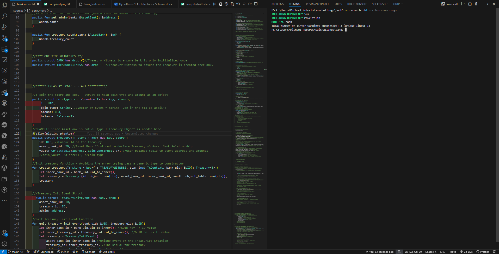

# 🌈✨ Smart Contract Starter Guide 🚀

Welcome to the future of decentralized applications! This guide will help you get started with our Sui-based smart contract. Let's dive in! 🌊


# 🚀 Asset Bank NFT Smart Contract (Sui Move) - Complier version 1.4.1

> "A seamless way to deposit, store, and withdraw assets on the **Sui Blockchain** using **Move**."

## 📜 Overview

This repository contains `bank.move`, a **smart contract** designed for **secure asset deposits** on the Sui blockchain.
Users receive **NFT receipts** when depositing assets and can redeem them for withdrawals.

## ✨ Features

✅ **Deposit Any Coin<T>** – Supports generic assets
✅ **NFT Receipts** – Proof-of-ownership for each deposit
✅ **Secure Withdrawals** – Claim your deposited funds using receipts
✅ **Event Emission** – Get real-time updates on deposits & withdrawals

---

## 🛠️ My Installation Guide

### **For Windows Users** 🪟

### **1️⃣ Install Move CLI & Sui**

### ***Quickest way to get started is to install Sui via chocolatey*** ###

### Install Chocolately (if not install)

    # Install Move CLI (if not installed) -
    ## In Powershell (Make sure to start as administrator!)
    ```
        choco install sui
    ```

```sh


# Install Move CLI (if not installed)
cargo install --git https://github.com/MystenLabs/sui.git --branch main --locked
```

## ** For MacOS/Linux User 🐧

```sh
curl -fsSL https://get.sui.io | bash
source ~/.bashrc  # or ~/.zshrc for zsh users
```

### **2️⃣ 3 Clone & Setup**

## Verify Your Installation is complete ###

```sh
    sui --version 
```

# You should see the current version which should be v1.4.1 as of Jan 2025

```sh
git clone https://github.com/therealmoneymikes/sui-asset-bank.git
cd sui-asset-bank
```

##

### **3️⃣ Build & Test Contract 🚀**

```sh
# Compile the smart contract 
sui move build

##Your code should compile with zero errors and non-threating linter warnings


# Complie the smart contract to silence non-threating linting warnings e.g unused error codes 
## **Please note that complier the following warnings are non threating
##   warning[w09001] are unused alias is non-threating ##
##    warning[W02021]: duplcate alias 


sui move build --silence-warnings 
##By running sui move build --silence-warnings you code will compiler with no errors



## **🧪 Running Tests ** 
sui move test

# Deploy to local network
sui client publish --gas-budget 10000000


## **IMPORTANT NOTICE**


### **3️⃣ Build & Test Contract 🚀**
##Example 
## Syntax for calling a public function 
## = call --function <name_of_public_function> --module <bank>
```sh
    sui client call --function bank --module deposit
    --package <YOUR_PACKAGE_ID> --gas-budget 10000000
```
##For more info gas, visit the official move book referenece - <https://move-book.com/your-first-move> hello-sui.html ##

## 📚 Project Structure

## 📜 Smart Contract Logic

```
.
├── docs/            # My Docs of the architectural guide 🚀
├── sources/         # Your Move smart contracts 🚀
├── tests/           # Test modules 🧪
├── Move.toml        # Project manifest ✨
└── README.md        # This my glorious guide 😉


```

## 🎨 Visual Flow (Animated)

```ascii
    +-------------------+
    |  Asset Bank      |
    |-------------------|
    |  Deposits: #     |
    |  Active NFTs: #  |
    +-------------------+
            |  🔽 Deposit
            v
    +-------------------+
    |  NFT Receipt     |
    +-------------------+
            |  🔽 Redeem
            v
    +-------------------+
    |  Withdrawal      |
    +-------------------+
```

---

## 🛠 Future Improvements

- [ ] **Upgrade Treasury Logic*
- [ ] **Support Dynamic Coin Types**
- [ ] **Improve Gas Efficiency**

## 🏆 Credits

💡 Pro Tips
Use sui client active-address to check your current address

Run sui client objects to list owned objects

Add --skip-fetch-latest-git-deps to build faster during development

🎨 Features
✅ Secure by design

✅ Gas-efficient operations

✅ Comprehensive test coverage

✅ Cross-platform compatibility

✅ Community-driven development

🤝 Contributing
We welcome contributions! Please see our Contribution Guidelines for details.

⭐ Star this repo if you find it useful! ⭐

Sui Blockchain

Developed by **[@therealmoneymikes](https://github.com/therealmoneymikes)** 🚀
